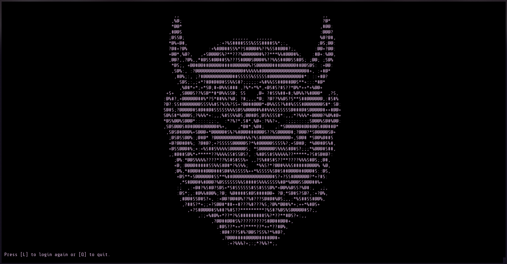
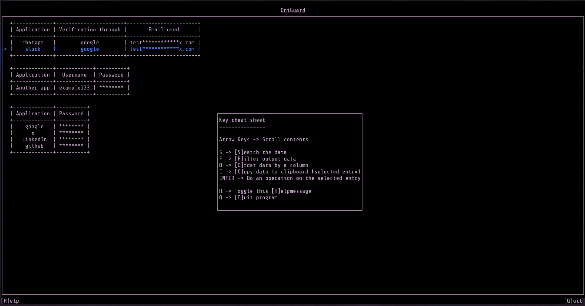
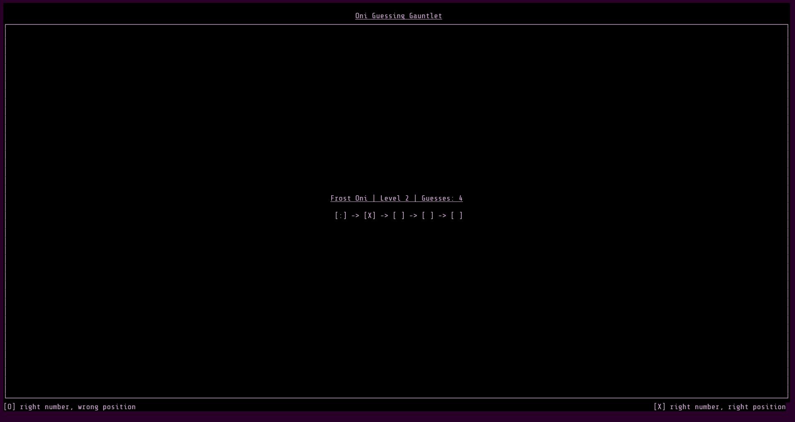
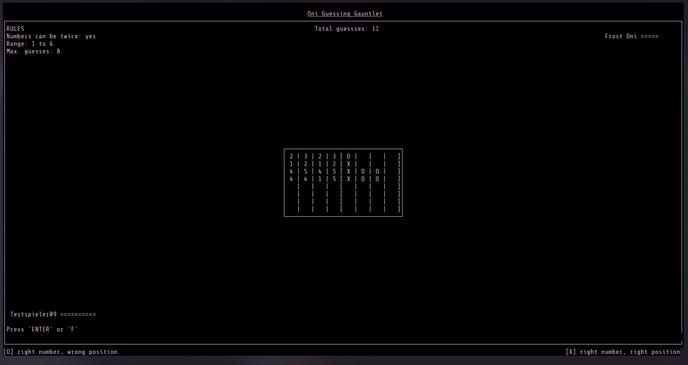

# OniGuard
 [](https://github.com/psf/black)

**Leave a ⭐ if you like this project**

## A terminal based password manager

OniGuard is a terminal application written in python. It has a playfull oni theme and is a basic password manager.

> [!Important]
> Do not try to resize the program during execution as it leads to problems.
>
> This may be a problem with pythons curses wrapper.

## Sneakpeaks

<details><summary>Lockscreen</summary>



</details>
<details><summary>Main screen</summary>



</details>
<details><summary>Map / Progress screen</summary>



</details>
<details><summary>Game</summary>



</details>

## Features

- Support for schemes (unique tables with defined columns)
- Search function (fuzzy finder)
- Basic operations (add, change, delete)
- Filter and order the data to your needs
- Copy data to clipboard
- a lockscreen
- a small game

## Help

The help message outputted by `py oniguard.py -h`.

```txt
usage:
________           .__   ________                            .___
\_____  \    ____  |__| /  _____/  __ __ _____   _______   __| _/
 /   |   \  /    \ |  |/   \  ___ |  |  \\__  \  \_  __ \ / __ |
/    |    \|   |  \|  |\    \_\  \|  |  / / __ \_ |  | \// /_/ |
\_______  /|___|  /|__| \______  /|____/ (____  / |__|   \____ |
        \/      \/             \/             \/              \/

       [-h] [-d] [-g] username

An Oni-themed password manager, primarily designed for terminal use, though a GUI could be seamlessly integrated.

The manager boasts several features:
    - password generation
    - a robust search function and
    - editable schemes.

Additionally, it incorporates color-coded elements and employs cryptography for enhanced security purposes.

positional arguments:
  username      Specify which user you want to login as.

options:
  -h, --help    show this help message and exit
  -d, --delete  Delete the specified user.
  -g, --game    Play an oni themed game.

Have fun with it = )
```

The helpmessage for the program.

```txt
Key cheat sheet
===============

Arrow Keys -> Scroll contents

S -> [S]earch the data
F -> [F]ilter output data
O -> [O]rder data by a column
C -> [C]opy data to clipboard (selected entry)
ENTER -> Do an operation on the selected entry

H -> Toggle this [H]elpmessage
Q -> [Q]uit program
```

### Select and deselect checkboxes

To select or deselect a checkbox just press the spacebar.

### Game stuck on the map / progress screen

Just press `ENTER` to continue.

### Program crashes

The most likely thing to happen is that the window / screen is to small to display all contents. Try again after resizing your window with `CTRL + -`.

## Installation

On Microsoft Windows run

```txt
pip install -r requirements.txt
```

On other operating systems run

```txt
pip install -r requirements_no_windows.txt
```

## Pyperclip on Linux

> [!Note]
> On Linux, you'll need the xclip or xsel command (installed via apt, etc.), and the gtk or PyQt4 modules (installed via pip).

<sup>

Here is the [source](https://note.nkmk.me/en/python-pyperclip-usage/) of the above statement.

</sup>

For more information take a look at the [documentation](https://pyperclip.readthedocs.io/en/latest/#not-implemented-error).
